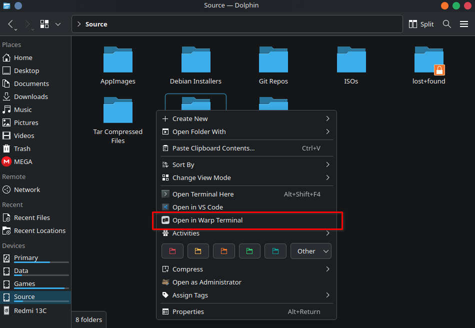

# Dolphin Service Menu: Open in Warp Terminal

*Disclaimer: This project is not affiliated with Warp Terminal at all*

## Introduction

A service menu for the dolphin file manager that opens the current folder inside Warp terminal.

Similar to how dolphin has support for opening folders in Konsole, this service menu adds the option to right click and open any folder in Warp terminal.

## Requirements

Warp terminal must be installed for this service menu to work. For more info on Warp terminal installation, please refer to [warp.dev](https://www.warp.dev/)

## Installation
There are 2 methods of installation

### 1. Using built-in downloader (KDE Store)

1. Open Dolphin
2. From the settings, hover over Configure, then select Configure Dolphin
3. Select Context menu from the left side and click on `Download New Services`
4. Search and install this service.
5. In the Context menu, enable the `Open in Warp Terminal` service.

[TODO: Add KDE store link here](...)

### 2. Manual Installation

Download the `openInWarpTerminal.desktop` file from this repository and put it in the following path.

`~/.local/share/kio/servicemenus/`

Note: The directories may not exist yet, so simply create them and then put the file there.

For some old versions of KDE, the path may be different. Please refer to this [guide](https://develop.kde.org/docs/apps/dolphin/service-menus/) for details.

## Known Issues

Unlike other applications like Konsole that can open folders in the terminal using commands, this service menu utilizes a workaround which doesn't well with some default Warp terminal's settings.

if the setting `Restore windows, tabs and panes on startup` is enabled (which it is by default), 2 windows get opened when using this service menu. One that restores the windows and tabs for the setting and one that has the folder opened within it.

Disabling this setting should open only a single window with the required folder.

## Testing

This service menu is tested on Kubuntu 25.10 (Plasma 6) and Kubuntu 24.04 (Plasma 5).

Other than the issue mentioned in the section above, I haven't found any other issue.  Please open an issue if you find encounter any.

## Screenshot

